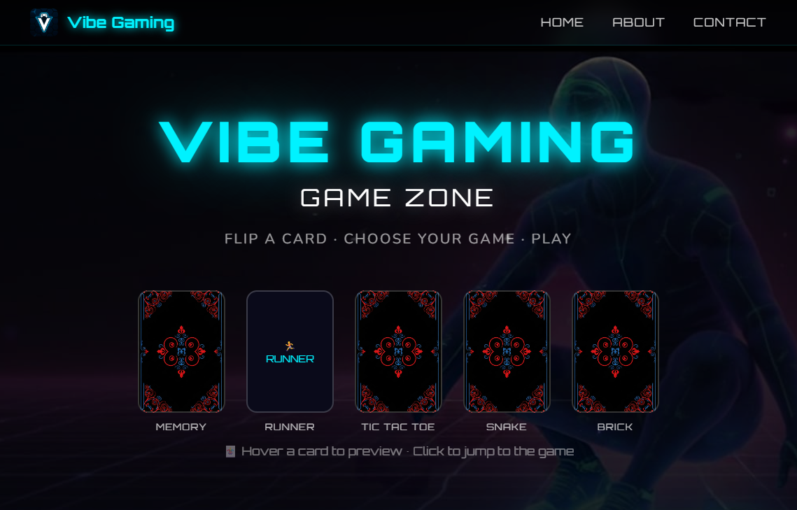
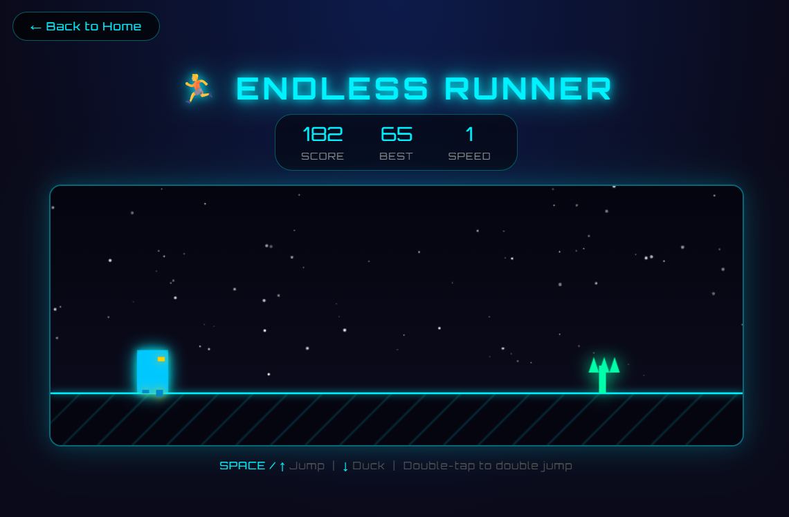
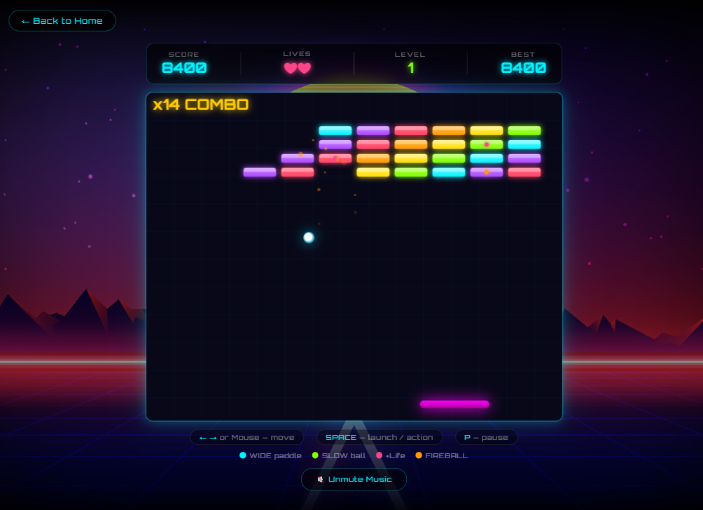
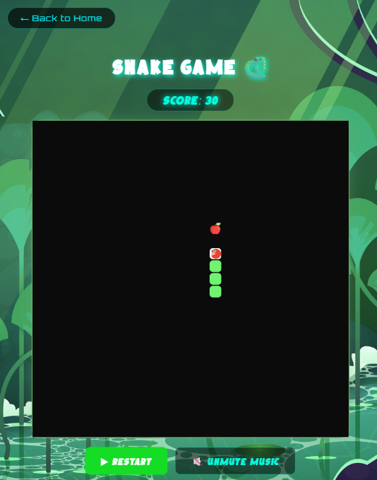
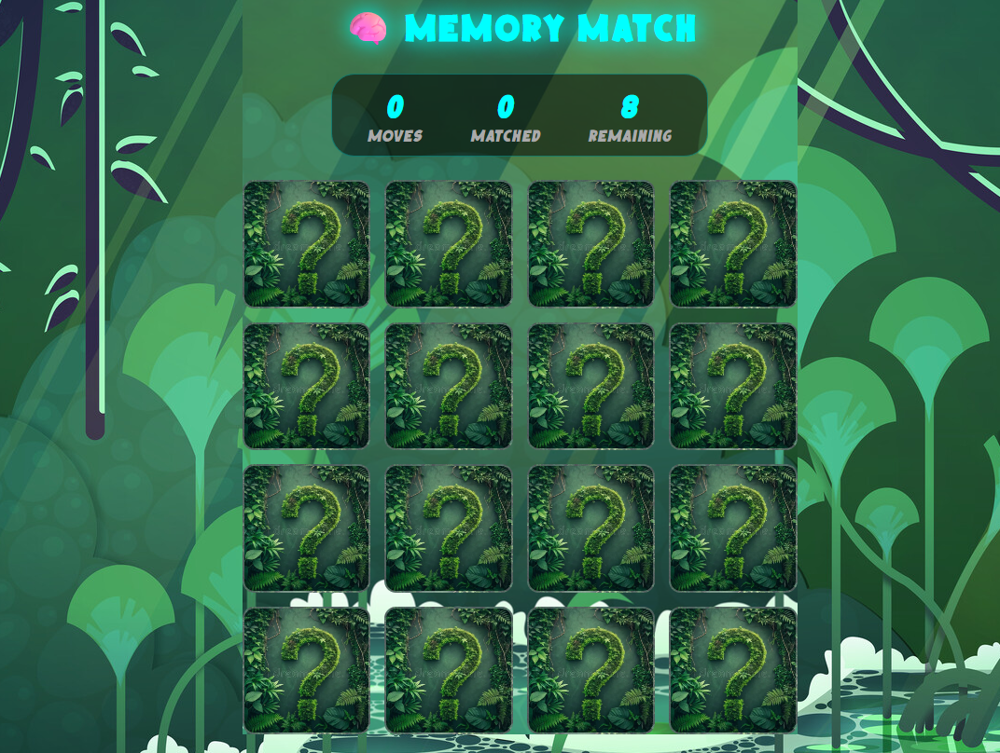
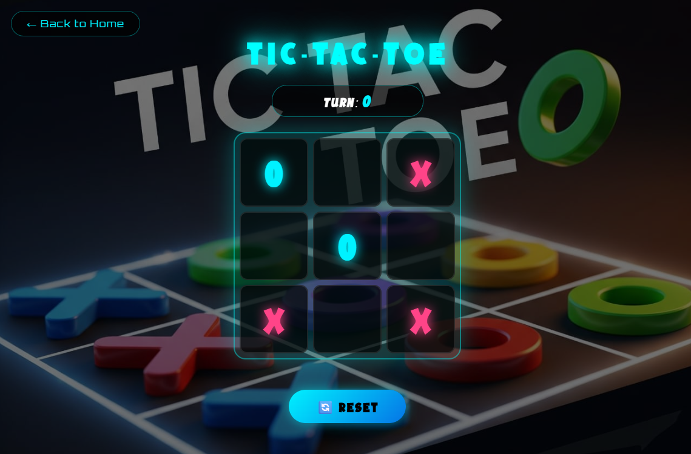

# 🎮 Vibe Gaming

A personal browser-based gaming hub built entirely from scratch using vanilla HTML, CSS, and JavaScript.

No frameworks. No game engines. No build tools.

Just hand-written code, creativity, and a passion for web development.

> **No downloads. No installations. Just click, play, and enjoy.**

---

## 🌐 Live Demo

🔗 **Live Website:**  
https://gouravgupta1606.github.io/Vibe-Gaming/

Experience all games directly in your browser with no setup required.

---

## 📸 Project Preview

### Home Page Preview 



### Endless Runner preview 



### Brick Breaker Gameplay 



### Snake Game 



### Memory Match 



### Tic Tac Toe preview 

 


---

## 🕹️ Games Included

| Game | Description | Controls |
|--------|-------------|----------|
| 🧠 Memory Match | Match all emoji pairs in the fewest moves. Cards shuffle randomly every game. | Mouse Click |
| 🏃 Endless Runner | Jump and dodge obstacles while the game speed continuously increases. | Space / ↑ Jump · ↓ Duck |
| ❌ Tic-Tac-Toe | Classic X vs O multiplayer game. | Mouse Click |
| 🐍 Snake | Eat food, grow longer, and avoid collisions. | Arrow Keys |
| 🧱 Brick Breaker | Advanced multi-level brick breaker with power-ups, combos, particles, and lives system. | Mouse / ← → · Space Launch · P Pause |

---

# ✨ Brick Breaker Highlights

The most technically advanced game in the project.

### Features

- 8 Progressive Levels
- 3 Life System
- Persistent High Score
- Combo Multiplier (up to 8x)
- Particle Effects
- Paddle Angle Control
- Accurate Collision Detection
- Keyboard + Mouse Controls
- Pause / Resume System
- Full Game State Management

### Power-Ups

| Power-Up | Effect |
|-----------|---------|
| 🟦 WIDE | Expands paddle width for 7 seconds |
| 🟩 SLOW | Reduces ball speed for 6 seconds |
| 🔴 +Life | Adds an extra life (maximum 5) |
| 🟠 FIRE | Ball passes through bricks for 5 seconds |

---

# 📁 Project Structure

```text
Vibe-Gaming/
│
├── index.html
├── about.html
│
├── assets/
│   ├── images/
│   ├── videos/
│   └── audio/
│
├── css/
│   ├── main.css
│   ├── brick.css
│   ├── memory.css
│   ├── tictactoe.css
│   ├── snake.css
│   └── runner.css
│
├── js/
│   ├── home.js
│   ├── brick.js
│   ├── memory.js
│   ├── tictactoe.js
│   ├── snake.js
│   └── runner.js
│
└── games/
    ├── brick.html
    ├── memory.html
    ├── tictactoe.html
    ├── snake.html
    └── runner.html
```

---

# 🚀 Running Locally

### Option 1

Open:

```text
index.html
```

in any modern browser.

### Option 2 (Recommended)

Python Server

```bash
python -m http.server 8000
```

Node Server

```bash
npx http-server .
```

Visit:

```text
http://localhost:8000
```

---

# 🛠️ Tech Stack

| Category | Technology |
|------------|------------|
| Markup | HTML5 |
| Styling | CSS3 |
| Logic | Vanilla JavaScript (ES6+) |
| Graphics | HTML5 Canvas API |
| Storage | localStorage |
| Fonts | Orbitron, Nunito |
| Icons | Font Awesome 6 |

---

# 💼 Skills Demonstrated

### Frontend Development

- Semantic HTML5
- Responsive Design
- Modern CSS Layouts
- CSS Animations
- Glassmorphism UI
- Neon-Themed Design System

### JavaScript Development

- DOM Manipulation
- Event Handling
- Object-Based Game Logic
- State Management
- Collision Detection
- Animation Loops
- Local Storage Integration

### Problem Solving

- Game Architecture
- Performance Optimization
- User Experience Design
- Debugging and Testing

---

# 🎨 Design Philosophy

### Neon Gaming Aesthetic

The entire platform follows a futuristic gaming-inspired design language using:

- Cyan Glow Effects
- Dark Backgrounds
- Glassmorphism Cards
- Smooth Animations
- Consistent Visual Hierarchy

### Clean Project Architecture

Each game is fully isolated:

- Separate HTML
- Separate CSS
- Separate JavaScript

This improves:

- Maintainability
- Scalability
- Code Readability

### Performance Focus

Canvas-based games use:

```javascript
requestAnimationFrame()
```

instead of:

```javascript
setInterval()
```

for smoother rendering and better browser performance.

---

# 📌 Known Limitations

- Mobile touch controls are not implemented for canvas games.
- No backend integration.
- Footer feedback section is currently UI-only.
- High scores are stored locally and do not sync across devices.

---

# 👨‍💻 Developer

## Gourav Gupta

B.Tech Student  
Frontend Web Developer

### Skills

- HTML5
- CSS3
- JavaScript
- Responsive Design
- UI/UX Design
- Browser Game Development

GitHub:

https://github.com/GouravGupta1606

---

# 🎯 Project Purpose

This project was built to:

- Strengthen frontend development skills
- Learn game development fundamentals
- Practice JavaScript problem solving
- Build a portfolio-quality project
- Showcase real-world coding ability

---

# 📄 License

This project was created by **Gourav Gupta** for educational and portfolio purposes.

You are welcome to view and learn from the code. Redistribution, resale, or claiming the work as your own is not permitted.

---

⭐ If you enjoyed the project, consider starring the repository.